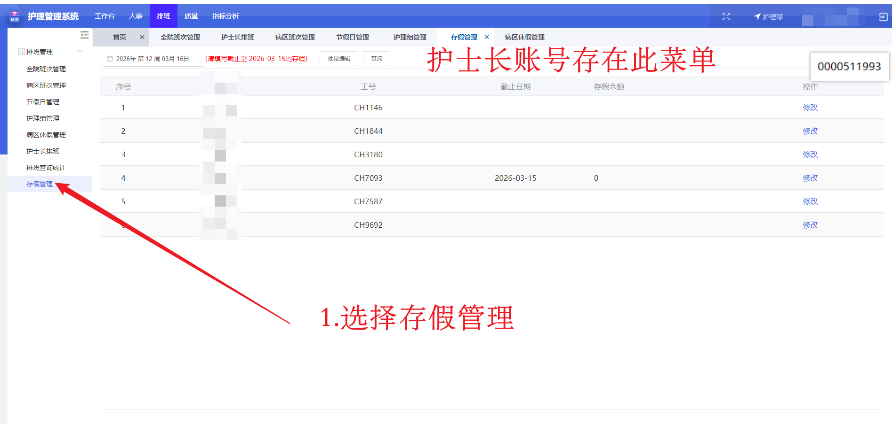
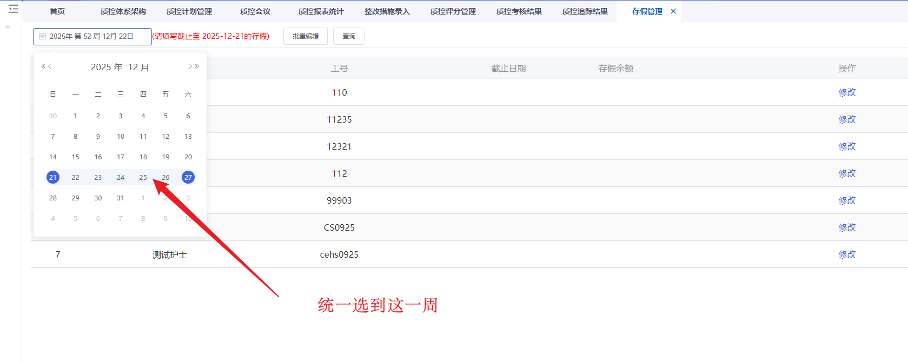
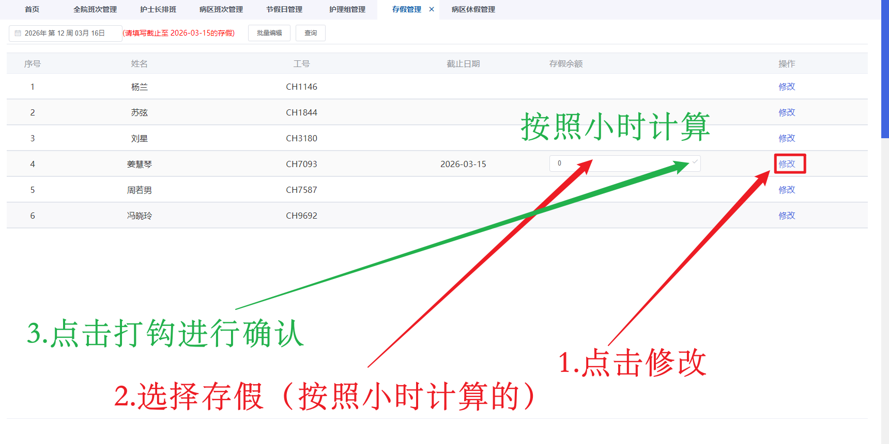

# 护理管理排班手册

[TOC]

## 1.病区班次管理

【功能简介】

对各个病区排班班次信息进行管理。

【操作描述】 

1. 列表显示病区班次信息，可以选择不同病区进行查看，可以通过条件进行班次过滤查询。
2. 点击[导出]，将当前显示的班次信息批量导出到Excel中。
3. 点击表格中的[上移]和[下移]可以调整班次的显示顺序，点击[删除]可以删除班次。

【界面图示】

 
图1-1 病区班次管理

## 2.新增病区班次

【功能简介】

新增病区班次。

【操作描述】

点击[新增]，弹出新增病区班次窗口，选择一个全院班次作为基础班次，录入班次信息，点击[保存]。

【界面图示】

  
图2-1 新增病区班次

## 2.编辑病区班次

【功能简介】

编辑病区班次信息。

【操作描述】

点击表格中的[编辑]，弹出编辑班次窗口，录入班次信息，点击[保存]。

【界面图示】

图2-1 编辑病区班次

## 3.护理组管理

【功能简介】

对病区护理组进行管理。

【操作描述】 

导航栏上，点击“排班管理→护理组管理”后，进入护理组管理界面

1. 显示病区的护理组信息，可以指定护理单元进行查看。
2. 点击[新增]弹出新增护理组窗口，录入护理组名称，点击[保存]。

图3-1 新增护理组

3. 点击表格中的[上移]和[下移]可以调整护理组的顺序。

3. 点击表格中的[编辑]弹出编辑护理组窗口，编辑护理组名称，点击[保存]。
4. 点击表格中的[删除]可以删除护理组。

【界面图示】

图3-2 护理组管理

## 4.护士长排班

【功能简介】

对病区护士进行排班操作。

【操作描述】 

1. 选择护理单元，可以查看该护理单元的排班，也可进行排班操作。
2. 默认显示当前周，可以点击[左移]和[右移]切换到上一周和下一周进行查询

图4-1

1. 选择周数，点击查询能够查看多周排班

图4-1 查看多周排班

1. 排班

图4-2 选择排班

2. 批量排班 操作：`Ctrl+拖拽`可批量排班，可横向纵向

<video src="./Images/%E6%8A%A4%E7%90%86%E7%AE%A1%E7%90%86/2026-03-06 10-44-04.mp4"   
  autoplay 
  muted 
  loop 
  controls>测试</video>

3. 点击[复制，粘贴]，可以复制选中的班次并粘贴使用

<video src="./Images/%E6%8A%A4%E7%90%86%E7%AE%A1%E7%90%86/2026-03-06 10-50-57.mp4"   
  autoplay 
  muted 
  loop 
  controls>测试</video>

4. 点击[删除]，可以删除选中的班次

图4-3 选择排班

1. 可以根据需要勾选人动班动、人动班不动、人不动班动，然后选择人员，点击[上移]和[下移]进行人员和排班顺序的调整。

<video src="./Images/%E6%8A%A4%E7%90%86%E7%AE%A1%E7%90%86/2026-03-06 11-02-10.mp4"   
  autoplay 
  muted 
  loop 
  controls>测试</video>

1. 双击排班单元格，弹出选择班次窗口，可以选择多个班次，可以录入排班备注，点击[保存]。

图4-4 排班备注

点击[保存]，保存当前排班。点击[发布]，发布当前排班，发布后不可修改，发布后的排班才能参与统计计算。护理部点击[撤销发布]，可以撤销病区的排班，撤销后护士长可以修改排班再次发布。

## 5.初始化基时（新增2026-03-20）

### 5.1背景

背景：当前护理管理中存在**排班累计存假**与实际记录不一致的问题，需利用**存假管理**功能模块对所有护士的累计存假进行初始化处理。

### 5.2现状说明

各护理单元与门诊护理组的排班方式存在差异：

- 部分按**一周**为周期排班，且**正式发布**；
- 部分已一次性排完整月班表，且**正式发布**。

### 5.3操作说明（操作规则）

- 护士长需在**最新排班周期所在的那一周**，在系统中对本科室护士的累计存假进行初始化操作，确保数据与最新排班表一致。

- 初始化操作必须以“累计叠加”为原则，严禁清零或覆盖原有数据。

- 每位护士的初始化存假总额，应按以下结构计算与录入：

  **初始化存假 = 实际工作存假 **

  其中：

  1. **实际工作存假**：依据最新排班与实际出勤记录核算的加班、调休等存假。
  2. **累计年假**：
     - 在**上一年度已维护的年假余额基础上**进行累加。
     - **每年新增的年假额度必须叠加到历史余额中**，不得覆盖或清除。

### 5.4操作入口

相关功能位于系统 **“存假管理”** 菜单内。

操作界面可参考下图：`图5-1 存假菜单` `图5-2 选择初始化日期` 

图5-1存假菜单

图5-2 选择初始化日期

图5-3 初始化节假日数据

操作视频

<video 
  src="./assets/2026-03-20 17-29-37.mp4" 
  autoplay 
  muted 
  loop 
  controls
>
  您的浏览器不支持HTML5视频
</video>

