# 护理管理质量管理

## 1 护理质控管理

### 1.1 质控体系架构

#### 【功能简介】对三级质控人员权限进行管理。

#### 【操作描述】导航栏上，点击“`质控管理`→`质控体系架构`”后，进入质控体系架构界面

1. 该界面仅**护理部**、**护士长角色**可见：护理部可维护全院质控权限，护士长可维护登录病区质控权限。
2. 质控片区以按照护理部，片区，科室逐级展现，片区树默认**自动展开**。
3. 在**护理单元**检索框，输入片区名称或首字母，检索框下方可显示对应的护理单元，点击节点后，右侧将显示该片区下的人员列表。`如图1-1`
4. 在**左侧上方的检索框**中，输入工号或姓名，右侧将显示对应的人员检索结果列表。`如图1-1`
5. 在左侧列表**选择片区节点**后，新增按钮可用（进入该界面默认为不可点击），点击**新增按钮弹出新增人员界面**（`如图1-2、图1-3`）。**选择对应人员**后，点击【保存】，**新增人员**将属于**左侧片区节点**，并且拥有该片区质控权限。
6. 在左侧列表选择片区节点后，【删除】可用（进入该界面默认为不可点击），如未选择人员，点击【删除】提示“请选择要删除的人员”。勾选列表中人员后，点击【删除】，提示“此操作将永久删除该类型，是否继续？”，点击【确定】后删除。（`图1-4`）

#### 【界面图示】

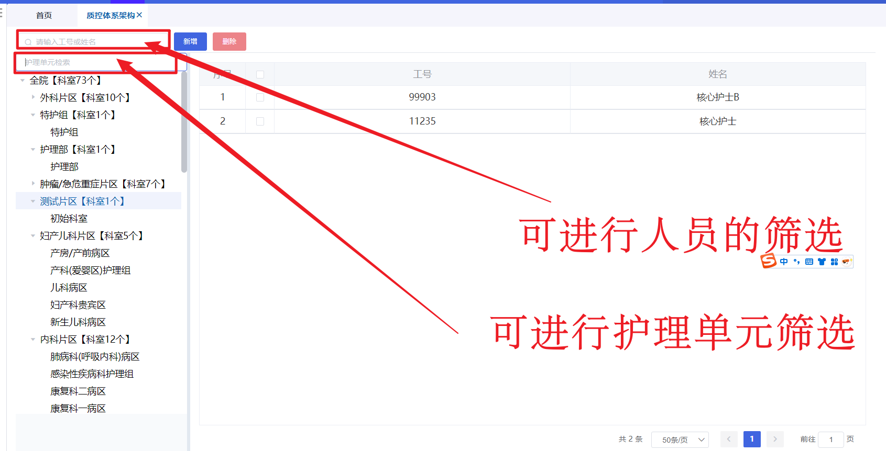

图 1-1质控体系检索功能

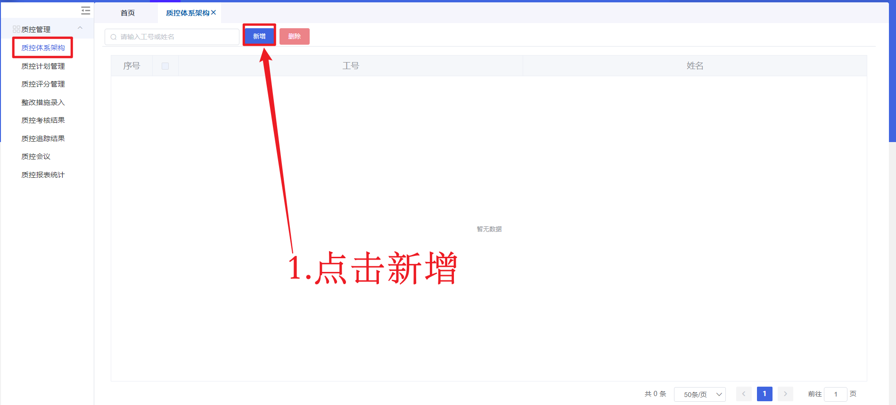

图 1-2质控体系创建质量人员

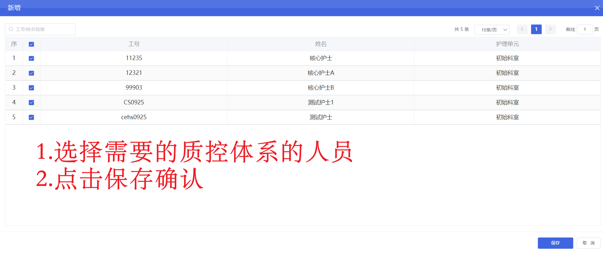

图 1-3质控体系选择质控人员

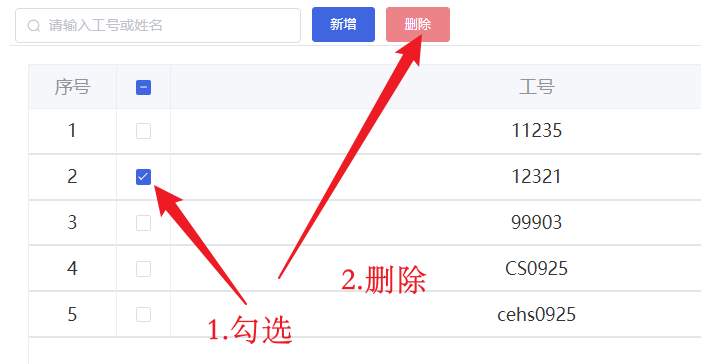

图1-4删除质控人员

### 1.2 质控计划管理

#### 【功能简介】该界面用于**维护质控计划**。

#### 【操作描述】 导航栏上，点击“质控管理→质控计划管理”后，进入质控计划管理主界面。

1.  **添加计划分类**
    *   **操作路径**: 在计划分类树中，选择**根节点**或某个**计划分类节点**。
    *   **操作步骤**:
        1.  点击【分类】按钮。
        2.  在弹出的“计划分类添加”界面中输入**分类名称**。
        3.  点击【保存】。
    *   **预期结果**: 系统提示“**保存成功**”。

2.  **添加计划组**
    *   **操作路径**: 在计划分类树中，选择**根节点**、**计划组**或**计划分类**节点。
    *   **操作限制与步骤**:
        *   选择**根节点**时，【添加】按钮**不可用**。
        *   选择**计划组**节点时，点击【添加】会提示“**添加失败，已是分类子集**”。
        *   选择**计划分类**节点时：
            1.  点击【添加】按钮。
            2.  在弹出的“计划组添加”界面中输入**计划组名称**。
            3.  点击【保存】。
    *   **预期结果**: 在计划分类节点下保存成功后，系统提示“**保存成功**”。

3.  **编辑节点名称**
    *   **操作路径**: 在计划分类树中，选择**根节点**、**计划分类**或**计划组**节点。
    *   **操作限制与步骤**:
        *   选择**根节点**时，【编辑】按钮**不可用**。
        *   选择**计划分类**或**计划组**节点时：
            1.  点击【编辑】按钮。
            2.  在弹出的编辑界面中输入新的**节点名称**。
            3.  点击【保存】。
    *   **预期结果**: 系统提示“**保存成功！**”。

4.  **删除节点**
    *   **操作路径**: 在计划分类树中，选择要删除的**计划分类**或**计划组**节点，点击【删除】。
    *   **删除计划分类**:
        *   **判断条件**: 系统判断该分类**是否包含子节点**。
        *   **预期结果**:
            *   如果**有子节点**，提示“**删除失败，请先删除子节点**”。
            *   如果**无子节点**，提示“**删除成功！**”。
    *   **删除计划组**:
        *   **判断条件**: 系统判断该计划组**下是否有计划**。
        *   **预期结果**:
            *   如果**有计划**，提示“**删除失败！请先删除组内计划！**”。
            *   如果**无计划**，提示“**删除成功！**”。

5.  **新建计划**
    *   **前提条件**: 在左侧计划树中选择一个**计划组**，此时【新建计划】按钮变为可用。
    *   **操作步骤**:
        1.  点击【新建计划】。
        2.  在弹出的“新建计划”界面中，填写以下必填项：**计划名称、督察周期、开始时间、结束时间、护理单元、评分人员、质控标准、评分对象**。
        3.  点击【保存】。
    *   **预期结果**: 系统提示“**保存成功。**”。

6.  **撤销已发布计划**
    *   **针对未被使用的计划**:
        *   点击【撤销】按钮，可撤销其发布状态。
        *   **预期结果**: 系统提示“**操作成功**”。
    *   **针对已被使用的计划**:
        *   点击【撤销】按钮，**无法**撤销其发布状态。
        *   **预期结果**: 系统提示“**该计划已经使用，不允许撤销！**”。

7.  **发布计划**
    *   **前提条件**: 存在**未发布**的计划。
    *   **操作**: 点击【发布】按钮。
    *   **预期结果**: 计划被发布，系统提示“**操作成功！**”。

8.  **预览计划**
    *   **操作**: 在计划管理界面，点击【预览】按钮。
    *   **预期结果**: 系统显示“计划预览”页面。该页面以**树形结构**展示该计划所选择的**质控标准评分项**。

9.  **删除计划**
    *   **针对未被评分的计划**:
        *   点击【删除】按钮可直接删除。
        *   **预期结果**: 系统提示“**删除成功！**”。
    *   **针对已被用作质控评分的计划**:
        *   点击【删除】按钮时，系统会弹出二次确认提示：“**该计划已经使用，是否继续?**”
        *   如果用户点击**确定**，则执行删除操作，**该计划及其下的所有评分均会被删除**。

#### 【视频操作】

<video 
  src="./assets/2026-03-31 11-54-50.mp4" 
  autoplay 
  muted 
  loop 
  controls
>
  您的浏览器不支持HTML5视频
</video>

视频1

### 1.3 新建质控计划

#### 【功能简介】新建质控计划。

#### 【操作描述】 

1.  **操作步骤**
    *   在界面中点击【新建计划】按钮。
    *   系统将弹出一个名为“新建质控计划”的窗口。
    *   在该窗口中，需录入或选择以下信息字段：
        *   **计划名称**
        *   **督查周期**
        *   **开始时间**
        *   **结束时间**
        *   **护理单元**
        *   **评分人员** **（必填：为空会导致评分人员无法找到这条任务）**
        *   **质控标准**
        *   **评分对象**（**科室、个人**）
        *   **评分次数**
    *   信息填写完毕后，点击窗口内的【保存】按钮。

2.  **预期结果**
    *   系统将保存录入的质控计划信息。
    *   通常，系统会关闭“新建质控计划”窗口，并在主界面给出“**保存成功**”或类似的操作成功提示。

【界面图示】

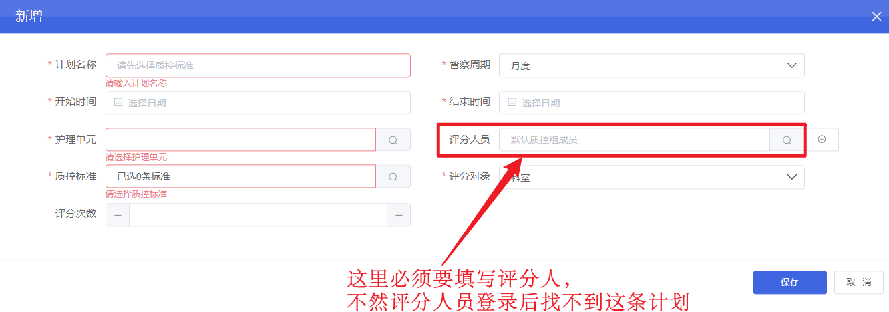

图1-5 编辑质控计划

###  1.4 质控评分管理

#### 【功能简介】对质控评分进行管理。

#### 【操作描述】 

1.  **选择层级进行评分**
    
    *   首先，在评分功能中**选择要进行评分的层级**（如个人、科室、护理单元等），系统将根据所选层级显示对应的评分界面和数据。(**按月进行分组**)
    
2.  **筛选评分计划**
    
    *   可通过指定筛选条件，快速定位需要处理的评分计划。可用的筛选条件包括：
        *   **科室**
        *   **时间范围**
        *   **计划名称**
    *   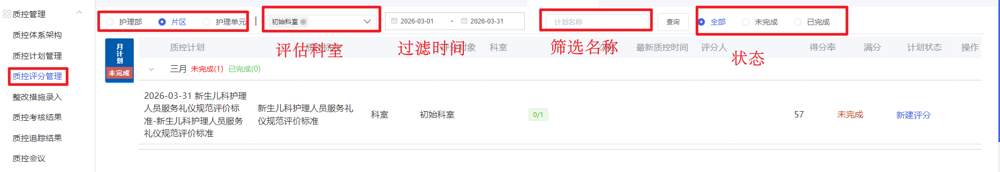
    
3.  **查看科室评分记录**
    *   在评分界面的下方，通常为科室列表或树形结构。**选中一个科室**后，下方的列表或表格区域会**显示该科室对应的所有评分记录**。

    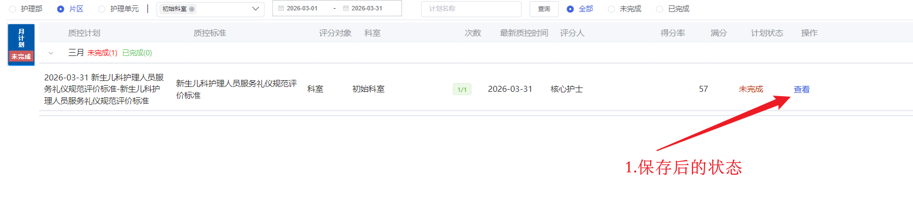
    
4.  **查看评分详情**
    
    *   在评分记录列表中，每条记录的右侧会有操作按钮。点击**对应记录右侧的【查看】按钮**，系统会弹出一个**评分记录详情界面**，用于展示该次评分的完整信息、分数及评语等。
    
5.  **删除未下发的评分**
    
    *   在评分记录列表中，针对状态为“**未下发**”的记录，其操作列会显示【删除】按钮。点击此【删除】按钮，可以**删除该条未下发的评分记录**。

#### 【界面图示】

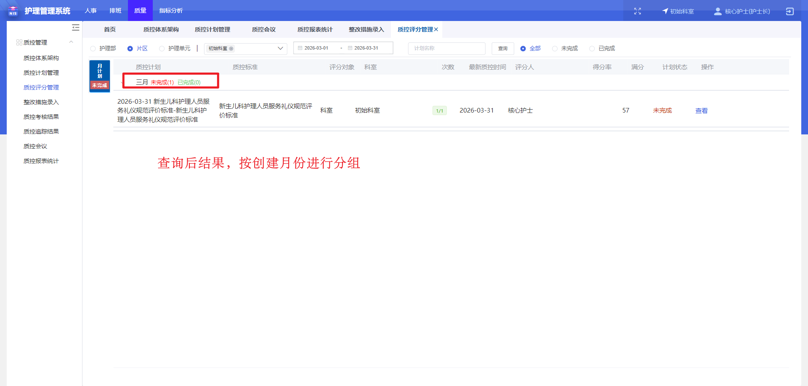

图1-6质控评分管理

### 1.5 新建质控评分

#### 【功能简介】

​	新建质控评分。

#### 【操作描述】

1.  **发起新建评分**
    *   点击【新建评分】按钮，系统将弹出“新建质控评分”窗口。

2.  **选择考核日期与整体备注**
    *   在窗口中首先**选择本次评分的“考核日期”**。
    *   可以录入针对本次评分整体的**评分备注**。

3.  **对不合格项目进行扣分操作**
    *   针对具体的**不合格项目**：
        1.  点击该不合格项旁的 **[-] 按钮**进行扣分。
        2.  在弹出的操作界面中，可以录入**例次**、**选择问题责任人**、**录入针对该项的具体评分备注**。

4.  **保存与提交**
    *   **保存**: 完成部分评分后，可点击【保存】按钮。**保存后，当前评分记录会暂存，用户可以继续对该次评分进行修改和补充评分**。
    *   **提交**: 完成所有评分后，点击【提交】按钮。**提交后，该次评分将被最终确定，不可再修改**。

#### 【界面图示】

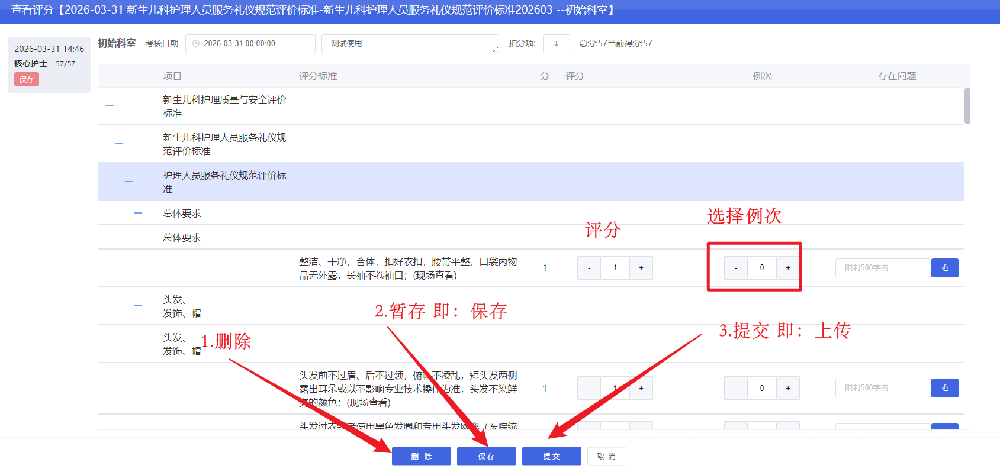

 图1-7 新建质控评分

### 1.6 质控考核结果

#### 【功能简介】对质控考核结果进行管理。

#### 【操作描述】 

1.  **访问路径**：在系统导航栏上，依次点击“**质控管理** -> **质控考核结果**”，系统将进入“质控考核结果”主界面。

2.  **查询考核结果**：在查询区，通过选择“**计划月份**”和“**评分月份**”，点击查询，可获取指定时间范围内的质控考核结果列表。

3.  **片区指定**：在考核结果列表中，选中**已提交的**计划任务，点击操作列中的【**片区指定**】按钮，可对任务的负责片区进行分配或调整。

4.  **审核与下发**：在考核结果列表中，选中需要下发的记录，点击【**审核下发**】按钮。

5.  **导出结果**：点击列表上方的【**导出**】按钮，可将当前界面显示的考核结果（包括所有筛选后的记录）**导出为一份Excel格式文件**，便于存档、打印或离线分析。

#### 【界面图示】

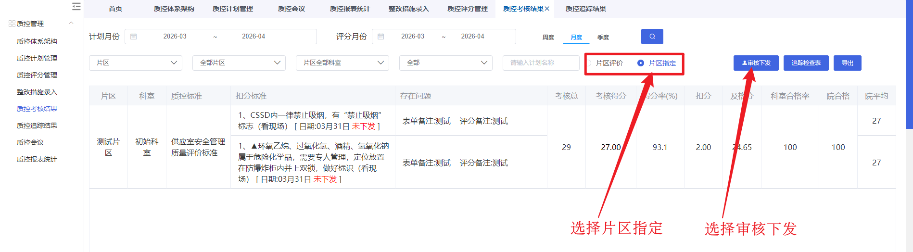

图1-8 审核下发

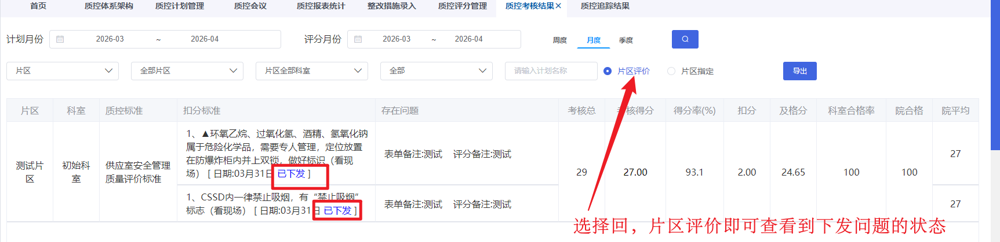

图1-9 质控考核结果

### 1.7 措施整改录入

#### 【功能简介】对质控考核结果进行措施整改录入。

#### 【操作描述】

1.  **进入界面**
    *   操作路径：在系统导航栏依次点击“**质控管理** → **质控考核结果**”。

2.  **查询考核结果**
    *   操作步骤：
        1.  在顶部查询区域设置筛选条件：
            *   **计划时间** (如：2026-03 ~ 2026-04)
            *   **评估时间** (如：2026-03-03 至 2026-04-30)
            *   **质控层级** (如下拉选择)
            *   **状态** (如下拉选择)
        2.  （可选）可进一步指定“片区”、“科室”、“计划名称”进行筛选。
        3.  点击【**查询**】按钮。
    *   预期结果：界面列表区域刷新，显示符合筛选条件的考核结果记录。

3.  **查看结果列表**
    *   查询结果以表格形式展示，关键列包括：**片区、科室、质控层级、质控标准、扣分标准、存在问题、表单备注、原因分析、整改措施、整改结果、操作**。

4.  **下发结果（生成追踪表）**
    *   操作步骤：
        1.  在结果列表中，选中需要下发的记录。
        2.  点击列表上方的【**下发**】或【**审核下发**】按钮。
    *   预期结果：系统基于选中的评分结果，生成一份【**追踪查检表**】，进入问题追踪与整改流程。

5.  **导出结果**
    *   操作步骤：
        1.  设置好筛选条件，点击【查询】得到目标结果列表。
        2.  点击列表上方的【**导出**】按钮。
    *   预期结果：系统将当前列表中的数据**导出为Excel文件**。

6.  **进入追踪检查**
    *   操作步骤：
        1.  在结果列表中定位到具体记录。
        2.  点击其操作列中的【**追踪检查表**】按钮。
    *   预期结果：系统弹出“追踪检查”窗口，显示该记录关联的详细问题列表。

7.  **追踪检查操作 (在弹出窗口中)**
    *   **筛选问题**：可通过“护理单元”、“追踪状态”等条件对窗口内的问题进行二次筛选。
    *   **批量操作**：
        *   点击【**一键整改**】：将所有显示的问题状态设为“**已整改**”。
        *   点击【**一键未整改**】：将所有显示的问题状态设为“**未整改**”。
    *   **编辑单条问题**：针对每个问题，可录入其“追踪整改结果”。
    *   **保存进度**：点击【**保存**】，保存当前所有修改，窗口不关闭，可继续操作。
    *   **提交结果**：点击【**提交**】，提交后结果被锁定，不可再编辑。
    *   **撤销提交**：对已提交的结果，点击【**撤销**】，可恢复编辑状态。
    *   **导出列表**：点击【**导出**】，将当前窗口内的问题列表导出为Excel。

#### 【界面图示】

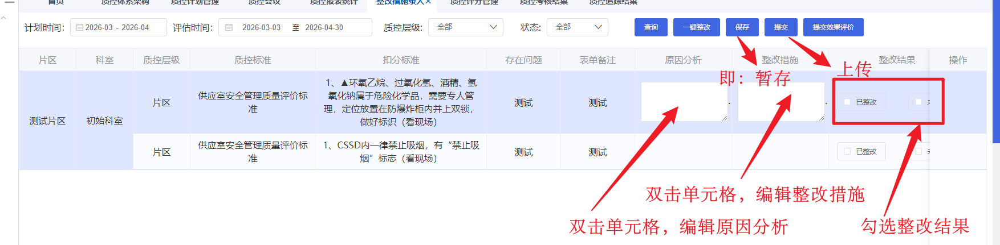

图1-10质控考核结果 

### 1.8 追踪检查

#### 【功能简介】

对质控问题进行追踪检查。

#### 【操作描述】

1.  **访问追踪检查**：在相关界面，点击【**追踪检查表**】按钮，系统将弹出“追踪检查”窗口。

2.  **筛选问题**：在追踪检查窗口内，可以通过以下条件对问题进行筛选：
    *   **护理单元**
    *   **追踪状态**（如：已整改、未整改、待确认等）
    *   **提交状态**
    *   **计划名称**

3.  **批量整改：设置为已整改**：点击【**一键整改**】按钮，系统将当前列表中所有**被筛选出的问题**状态批量更新为“**已整改**”。

4.  **批量整改：设置为未整改**：点击【**一键未整改**】按钮，系统将当前列表中所有**被筛选出的问题**状态批量更新为“**未整改**”。

5.  **导出列表**：点击【**导出**】按钮，可将当前窗口中显示的问题列表**导出为一个Excel格式文件**。

6.  **录入单条问题整改结果**：针对列表中的**每个具体问题**，可以进入其详情或直接在当前行，**录入该问题的“追踪整改结果”**（如原因分析、整改措施、整改人等）。

7.  **保存进度**：在检查和录入过程中，点击【**保存**】按钮。此操作会保存当前所有修改，**窗口不会关闭，用户可以继续进行后续的检查与录入**。

8.  **提交结果**：完成所有检查与录入后，点击【**提交**】按钮。提交后，**当前追踪检查的结果将被锁定，不可再进行编辑**。

9.  **撤销提交**：对于**已提交**的追踪检查结果，可以点击【**撤销**】按钮。撤销后，该检查结果**恢复为可编辑状态**，用户可以继续进行修改。

#### 【界面图示】

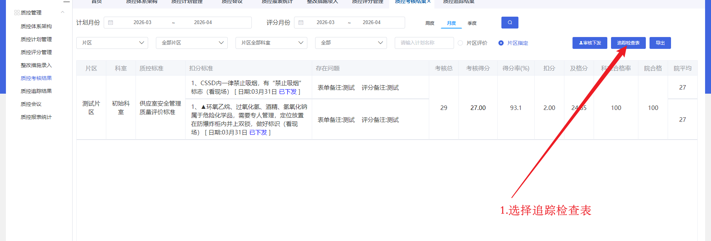

图1-11 追踪检查

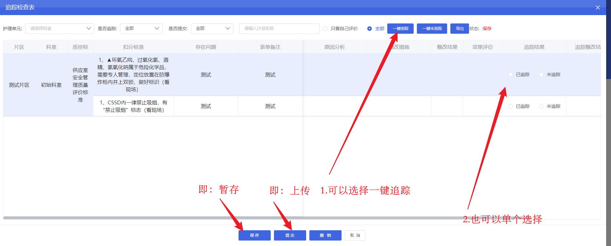

图1-12 追踪检查-一键追踪

### 1.9质控追踪结果

#### 【功能简介】

对质控追踪检查结果进行管理。

#### 【操作描述】 

1.  **进入界面**
    *   操作路径：在左侧导航栏中，点击“**质控追踪结果**”菜单项，进入质控追踪结果主界面。
2.  **设置查询条件并查询**
    *   操作步骤：
        1.  在顶部查询区域设置筛选条件：
            *   **计划月份选择**：选择计划所属月份（如图中示例：2026-02 ~ 2026-02）
            *   **评分月份选择**：选择评分所属月份（如图中示例：2026-02 ~ 2026-02）
            *   **护理部**：选择护理部（如图中示例：护理部）
            *   **片区**：选择片区（如图中示例：全部片区）
            *   **科室**：选择科室（如图中示例：片区全部科室）
            *   **计划名称**：输入计划名称关键词（可选）
        2.  点击【**标准选择**】按钮，可选择具体的质控标准（可选）。
        3.  点击【**导出**】按钮，可导出当前查询结果（可选）。
        4.  点击【**查询**】按钮（蓝色放大镜图标）。
    *   预期结果：界面列表区域刷新，显示符合筛选条件的追踪结果记录。
3.  **查看结果列表**
    *   查询结果以表格形式展示，关键列包括：
        *   **片区**：如“外科片区”、“肿瘤/急危重症片区”、“妇产儿科片区”等。
        *   **护理单元**：显示具体的护理单元名称（部分被模糊处理）。
        *   **检查评分标准**：如“2026年2月护理总值班(病区)”。
        *   **具体缺陷问题**：显示具体的质控缺陷描述，包含“存在问题”、“日期”、“评分人”、“追踪人”等信息，部分条目后标注“[已整改]”。
        *   **追踪总项**、**合格项目**、**单项整改**、**综合整改**：显示各维度的统计或操作入口。
4.  **筛选与查看细节**
    *   可通过点击“**片区**”、“**护理单元**”、“**检查评分标准**”、“**具体缺陷问题**”等列的标题或使用列内筛选功能（如有）进行二次筛选。
    *   在“**具体缺陷问题**”列中，可点击蓝色链接（如“存在问题”、“已整改”）查看或跳转至更详细的整改记录。
5.  **操作记录示例**
    *   **外科片区**：
        *   护理单元：2026年2月护理总值班(病区)
        *   具体缺陷问题：
            *   ▲高危跌倒患者床头及手腕识别带有“防跌倒”标识(存在问题:跌倒高风险，腕带上没有标识)[日期:2026-02-07]
6.  **导出结果**
    *   操作步骤：
        1.  设置好筛选条件，点击【查询】得到目标结果列表。
        2.  点击【**导出**】按钮。
    *   预期结果：系统将当前列表中的数据**导出为Excel文件**。
7.  **其他操作**
    *   可通过点击“**单项整改**”、“**综合整改**”等操作按钮，进入对应的整改管理界面（具体操作流程见相关说明）。

#### 【界面图示】

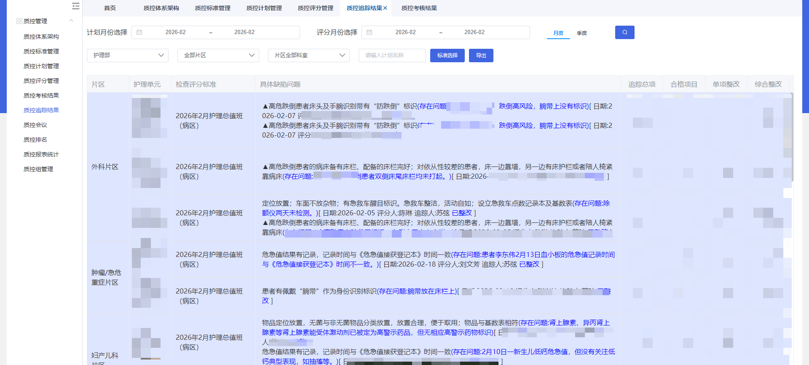

图1-13 质控追踪结果
