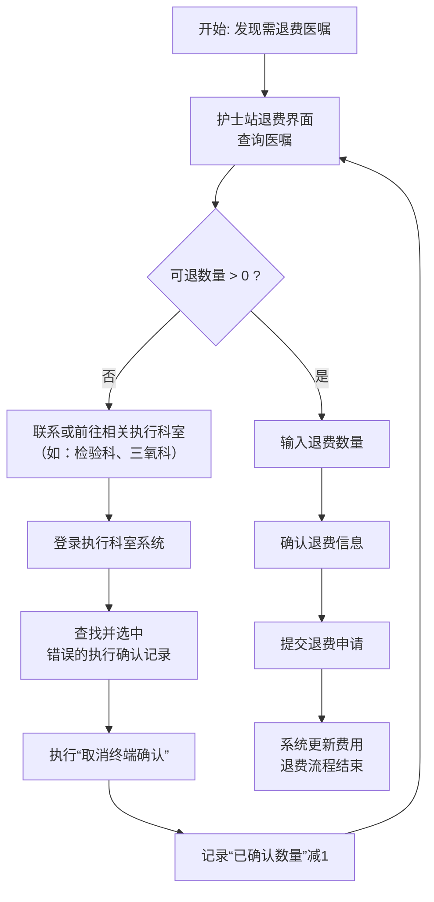

# 护理常见问题整理

[TOC]


## 1.HIS护士站

### 1.未终端确认

例如：下面是未终端确认的项目，如**图1-1**第三条`硬性耳内镜检查`，需要耳鼻喉科医生工号登录`终端确认`角色，如**图1-2**


<center>图1-1</center>

选择角色`终端确认`，科室选择`耳鼻喉门诊`


<center>图1-2</center>

选择住院终端确认，如图1-3


<center>图1-3</center>

选择对应的科室的患者，或输入住院号进行查询患者。操作如**图1-4**。


<center>图1-4</center>

勾选需要确认的项目，点击保存进行终端确认，如**图1-5**所示


<center>图1-5</center>

### 2.终端取消未退费

当医嘱数量为2次而患者仅实际执行1次，但执行科室在系统中误将两次均做了终端确认时，护士站退费界面会因已全部确认而显示可退数量为0，无法直接退费。此时，需先由执行科室进入系统，找到该医嘱项目，将多确认的1次（如第二次）取消终端确认，使其状态回退为“未执行确认”；随后护士站重新进入退费界面，系统即会更新可退数量为1，此时方可输入退费数量1并完成退费操作。





**如图2-1**，此医嘱在终端确认科室为耳鼻喉门诊，现在可退数量为`0`,这条医嘱如果是多收费用则，需要在终端取消确认输入患者住院号进行查询，**如图2-2**


<center>图2-1</center>

输入患者住院号进行查询


<center>图2-2</center>


<center>图2-3</center>


<center>图2-4</center>

取消终端确认后，可退数量会从 **0 -> 1**,操作如图


<center>图2-5</center>

输入数量后自动带入下放1


<center>图2-6</center>


<center>图2-5</center>

### 3.未审核的退费申请

场景：在此场景下，由于退费申请已提交但尚未审核，其状态为“待审核”。若审核护士确认申请无误，可直接在审核界面通过该申请以完成退费。如图


<center>图3-1</center>

审核退费


<center>图3-2</center>

### 4.药房未发药取消摆药申请

此场景：药房未进行摆药（即：**未发药状态**），取消摆药后药房看不到需要摆的药。操作`如图4-1`


<center>图4-1</center>

### 5.查询药房是否已经发药

##### 5.1 使用数据库查询

场景：查询药房是否已经发药，根据此段sql可以查询，是否发药或者是否取消摆药等信息。

```sql
SELECT 
    a.trade_name AS "药品商品名称",
    TO_CHAR(a.apply_date, 'YYYY-MM-DD HH24:MI:SS') AS "申请日期",
    TO_CHAR(a.druged_empl) AS "摆药人",  
    TO_CHAR(a.druged_date, 'YYYY-MM-DD HH24:MI:SS') AS "摆药日期",
		TO_CHAR(a.use_time, 'YYYY-MM-DD HH24:MI:SS') AS "使用时间",
    CASE 
        WHEN a.apply_state = 0 THEN '申请'
        WHEN a.apply_state = 1 THEN '打印配药'
        WHEN a.apply_state = 2 THEN '核准'
        WHEN a.apply_state = 3 THEN '作废'
        WHEN a.apply_state = 4 THEN '暂不摆药'
        WHEN a.apply_state = 5 THEN '护士统领'
        ELSE '未知状态(' || TO_CHAR(a.apply_state) || ')'  
    END AS "申请状态",
    TO_CHAR(a.cancel_date, 'YYYY-MM-DD HH24:MI:SS') AS "取消摆药日期",
    TO_CHAR(a.cancel_empl) AS "取消摆药员", 
    CASE 
        WHEN a.cancel_empl IS NOT NULL  THEN '是'
        ELSE '否'
    END AS "是否取消摆药"
FROM 
    pha_com_applyout a
JOIN 
    met_ipm_order b ON a.mo_order = b.mo_order
WHERE 
    b.inpatient_no = 'ZY0010000505485' -- 输入住院流水号
    AND a.trade_name LIKE '%盐酸氨溴索注射液%' -- 药品名称

```

查询结果如下，摆药人字段有数据代表药师已经在系统上操作过发药这个动作，如果为空分为两种情况，一直未未发药，另一种为护士申请了取消摆药，在取消摆药字段能查询到取消摆药的人，是否取消摆药则显示是


<center>图5-1</center>

##### 5.2 界面查询


<center>图5-2</center>

### 6.打印病理标签

场景：部分护士找不到打印病理标签的位置，找到病理标签的位置如下图**6-1**、**6-2**所示，


<center>图6-1</center>


<center>图6-2</center>


<center>图6-3</center>

### 7.医嘱丢失-执行档

场景：一些药品非药品，护士有时候反馈可能丢了医嘱，药房没把药发来，或者终端确认没看到对应的医嘱，有可能护士不小心把执行单给作废了。查询医嘱对应的医嘱是否作废如**图7-1**所示，如果作废需要恢复，如**图7-2**所示


<center>图7-1</center>


<center>图7-2</center>

### 8.死亡患者补录耗材需要选择死亡时间之前

医保报销的所有数据，尤其是住院费用明细，必须真实、准确，护嘱收费时间需要往前补录，操作如**图8-1**


<center>图8-1</center>

### 9.存在现有订单中不能进行退费


<center>图9-1</center>

## 2.NIS文书类

### 1.查询体温单数据

场景：在系统，患者当死亡在体温上生成死亡事件后，踢出院后又生成出院事件，系统做了限制无法手工在前台做删除，则需要在数据库进行删除事件。

```sql
select rowid, a.*
  from nsr_nis_record_detail a
 where a.inpatient_no like '%ZY001B100504853'
    and a.code = 'IN_Discharge' -- Code字段 IN_Discharge 出院事件 
   and a.show_temperature = 1; -- 是否展示在体温单
```

删除后需要查询界面如下：图2-1-1


<center>图2-1-1</center>

### 2.疼痛量表在打印预览界面查看不到对应数据

评价表1，如果是0分也需要拖动滑块进行触发疼痛评级，必须使得疼痛评级有勾选状态，代表这张表已经评价了，患者为0分需要触发滑块


<center>图2-2-1</center>

# 医生常见问题整理

## 1.住院医生站新增医保病种

1、上方按钮新增【医保病种】录入患者本次住院病种。


2、弹出当前界面里，第一栏信息自动带入患者入院登记信息，第二栏填写待遇类型和病种，第三栏当待遇类型是生育住院时需要继续填写。


3、收费处在病种结算界面即可看见医生填写的待遇类型和病种


## 2.皮试医嘱开立规则

**以下会涉及**

**治疗用药：给患者实际每天治疗用的药品。**

**皮试用药：给患者本次做皮试使用的药品。**

==**注：不用再单独开立皮试用药了，自动带出！！！**==

### 2.1门诊医生站

门诊医生开立治疗组合用药，系统会根据药房给定的规则自动生成一组皮试用药，两组药同时发送到药房，药房只发送皮试用药到输液室，皮试结果同时回传皮试用药和治疗用药。


### 2.2住院临时医嘱

同门诊医生站开立相同，住院护士录入的皮试结果同时回传皮试用药和治疗用药。


### 2.3住院长期医嘱

住院医生在**长期医嘱**里开立治疗组合用药，系统会根据药房给定的规则在**临时医嘱**里自动生成一组皮试用药，护士同时审核长期、临时医嘱，药房同时接受但是只发送临时医嘱的皮试用药，住院护士录入的皮试结果同时回传临时医嘱皮试用药和长期医嘱治疗用药。


## 3.医嘱待审核，抗生素需要审核

医生开立完，签发了，但是护士审核医嘱看不到   ---医嘱待审核，抗生素需要审核

## 4.特殊医保患者（产科等）登记医保信息  --手册

## 5.医生开不出药品   --默认取药科室	
