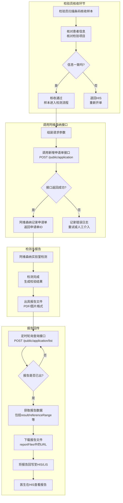

# WINLIS对接阿维森纳接口

---

### 各环节详细说明

#### 1. 调用阿维森纳接口环节

**触发条件：** 检验员**核收通过后**，触发调用阿维森纳的**申请接口**。

**操作流程：**

| 步骤 | 动作                 | 说明                                                         |
| ---- | -------------------- | ------------------------------------------------------------ |
| D1   | 组装请求参数         | 从LIS数据库中取出该申请单的完整信息，组装成JSON格式          |
| D2   | 调用新增申请单接口   | POST请求到 `https://limsapi.ibnsina360.com/public/application` |
| D3   | 判断接口返回是否成功 | 根据HTTP状态码和返回内容判断                                 |
| D4   | 成功处理             | 阿维森纳返回申请单ID，LIS将该ID保存到本地数据库，用于后续查询 |
| D5   | 失败处理             | 记录错误日志，设置重试机制（建议重试3次，间隔递增），超过重试次数则标记为异常，通知运维人员人工介入 |

**请求参数示例：**

```json
**请求头固定参数：**
X-Channel-ID: GDQFYY
Content-Type: application/json
```

```json
{

"doctorsId": "10086",

"doctorsName": "李医生",

"barCode": "GDQF202607030001",

"userName": "张三",

"age": "45",

"sex": "男",

"mobile": "13800138000",

"email": "zhangsan@example.com",

"productIds": "P202307001",

"productNames": "人α突触核蛋白",

"samplingTime": "2026-07-03 09:30:00",

"inspectionTime": "2026-07-03 10:00:00",

"inspectionDoctors": "李医生",

"inspectionDepartment": "神经内科",

"initialDiagnosis": "疑似帕金森病",

"applicationTime": "2026-07-03 08:50:00"

}
```

返回参数：


#### 2. 检测与报告环节

**触发条件：** 阿维森纳成功接收到申请单后。

**操作流程：**

| 步骤 | 动作                 | 说明                                              |
| ---- | -------------------- | ------------------------------------------------- |
| E1   | 阿维森纳实验室检测   | 阿维森纳内部流程，LIS无需干预                     |
| E2   | 检测完成生成检验结果 | 产生各项检测指标的数值                            |
| E3   | 出具报告文件         | 生成PDF或图片格式的报告文件，存放在阿维森纳服务器 |

**开发要点：**
- 此环节LIS不需要做任何操作，等待阿维森纳处理完成即可
- 检测周期因项目而异，可能是几小时到几天

---

#### 3. 报告回传环节

**触发条件：** 阿维森纳检测完成并出具报告后。

**操作流程：**

| 步骤 | 动作                | 说明                                                         |
| ---- | ------------------- | ------------------------------------------------------------ |
| F1   | 定时轮询查询接口    | 每隔一定时间（建议30分钟）调用查询接口                       |
| F2   | 判断报告是否已出    | 检查返回数据中的 details.result 字段是否有值                 |
| F3   | 获取报告数据        | 提取 result（检测结果）、referenceRange（参考范围）、highValue/lowValue（危急值）等 |
| F4   | 下载报告文件        | 从 reportFiles 字段中的URL下载PDF/图片到本地服务器           |
| F5   | 将报告回写至HIS/LIS | 将检测结果数据和报告文件写入LIS数据库，并通知HIS             |
| F6   | 医生在HIS查看报告   | 医生在HIS系统中打开该患者的报告查看                          |

**查询接口请求示例：**

```json
POST https://limsapi.ibnsina360.com/public/application/list?current=1&size=20

Headers:
X-Channel-ID: GDQFYY
Body:
{

"barCode": "GDQF202607030001",

"params": {

"applicationStartTime": "2026-07-03 00:00:00",

"applicationEndTime": "2026-07-03 23:59:59"

}

}
```

**返回结果中的关键字段说明：**

| 字段                     | 说明                            | 用途                 |
| ------------------------ | ------------------------------- | -------------------- |
| status                   | 审核状态：0待审核、1拒绝、2同意 | 判断申请单是否被接受 |
| remark                   | 审核备注                        | 拒绝原因说明         |
| details[].result         | 检测结果值                      | 写入LIS报告表        |
| details[].referenceRange | 参考范围                        | 用于判断结果是否异常 |
| details[].highValue      | 高值（危急值上限）              | 超出时触发预警       |
| details[].lowValue       | 低值（危急值下限）              | 低于时触发预警       |
| details[].itemName       | 项目名称                        | 对应检验项目         |
| reportFiles              | 报告文件URL                     | 下载报告文件         |
| auditTime                | 审核时间                        | 记录报告出具时间     |

**轮询策略建议：**




