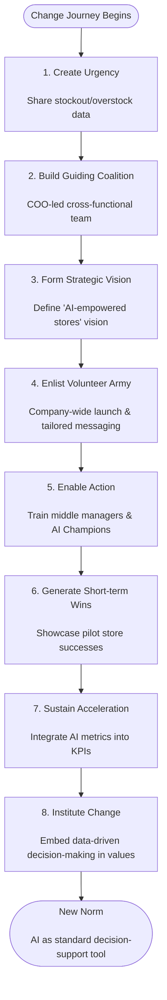
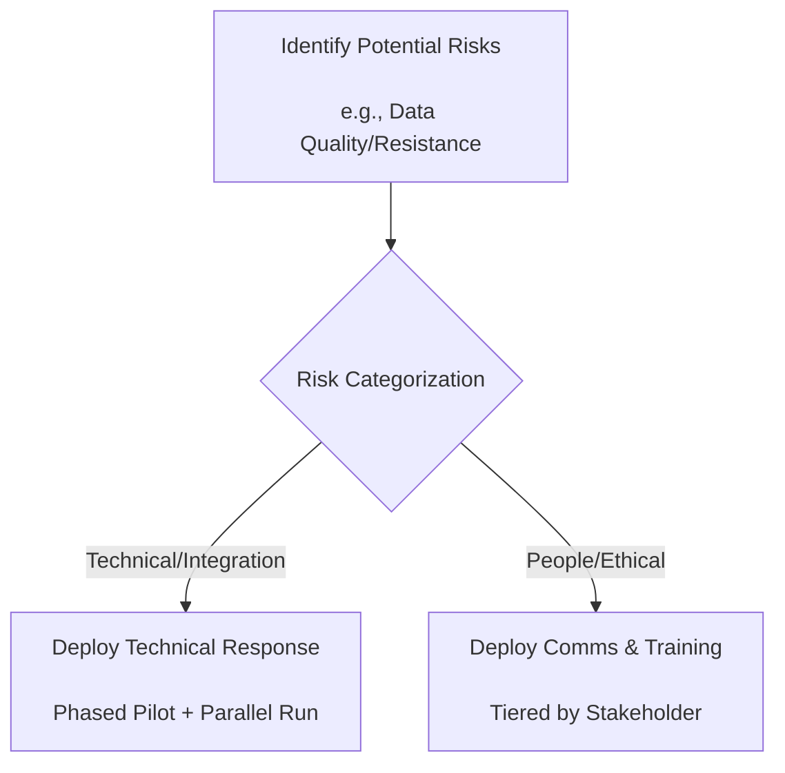

# Change Management Strategy for AI Transformation: A Case Study of "Nexus Retail"

## Abstract

The rise of artificial intelligence (AI) presents transformative opportunities for sectors like retail. However, its successful implementation is less a technical challenge and more a profound organizational change. This paper conducts a structured case study of the hypothetical multinational retail chain, Nexus Retail, as it prepares to deploy a large-scale, AI-driven inventory and demand forecasting system. The central argument is that the success of this AI initiative depends not only on algorithmic sophistication but, more critically, on a comprehensive, people-centric change management strategy. This analysis will systematically examine Nexus Retail's current state, diagnose potential resistance and readiness, and apply established change management models to formulate a holistic plan encompassing leadership, communication, risk mitigation, and evaluation. The aim is to ensure a smooth and sustainable AI transformation, providing a replicable framework for similar traditional enterprises navigating technological disruption.

## 1 Introduction

In the era of the digital economy, artificial intelligence is reshaping the business landscape. However, many organizations focus excessively on the technical implementation of AI while neglecting the concomitant human, procedural, and cultural shifts. The case of Nexus Retail exemplifies this prevalent challenge. The purpose of this study is to design a viable AI transformation strategy for Nexus Retail through a systematic change management framework. The significance of this research lies in offering practical guidance for traditional enterprises on balancing technological and human factors during AI adoption.

## 2 Organizational Context and AI Initiative

### 2.1 Organizational Profile

**Nexus Retail** is a traditional brick-and-mortar retailer with over 500 stores globally, facing intense competition from e-commerce giants. Although the company utilizes a basic Enterprise Resource Planning (ERP) system, its inventory management remains largely manual and reactive. This leads to frequent stockouts of bestsellers and overstock of slow-moving items, resulting in an estimated annual potential revenue loss of 15%.

### 2.2 AI Initiative Details

The company plans to deploy the "SmartStock" AI solution, which will integrate with existing ERP and Point-of-Sale systems. SmartStock utilizes machine learning models to analyze historical sales data, real-time trends, local events, weather patterns, and social media sentiment for high-precision, store-SKU level demand forecasting.

**Expected outcomes include:**
- A 30% reduction in stockouts
- A 25% decrease in excess inventory
- Logistics optimization
- Enhanced customer satisfaction

The rollout will be phased regionally over 18 months, requiring significant adjustments to the workflows of store managers, procurement, logistics, and IT staff.

## 3 Diagnosis of Resistance and Readiness

A thorough diagnosis is crucial for tailoring the change strategy.

### 3.1 Primary Sources of Resistance

1.  **Fear of Job Displacement:** Store managers and inventory clerks may fear that AI predictions will automate their core decision-making roles, rendering their experience obsolete.
2.  **Lack of Trust and Understanding:** Employees may perceive AI as a "black box," distrusting its recommendations, especially when they contradict long-held intuition. The "we've always done it this way" mindset will be a significant barrier.
3.  **Skills Gap and Anxiety:** Employees, particularly older ones, may feel anxious about interacting with new AI-driven interfaces and lack the data literacy skills to effectively interpret or override AI suggestions.
4.  **Process Inertia:** Adopting SmartStock requires standardized, consistent data entry and adherence to new protocols. Deviations can corrupt the AI's learning model, but enforcing this new discipline will face inertial resistance.

### 3.2 Organizational Readiness Analysis

| Readiness Dimension      | Rating     | Manifestation                                                |
| ------------------------ | ---------- | ------------------------------------------------------------ |
| **Leadership Alignment** | Low-Medium | Commitment from senior executives exists, but buy-in from middle managers is uncertain as their performance metrics and daily processes will be most directly altered. |
| **Cultural Readiness**   | Low        | The company culture is hierarchical and experience-driven. A shift towards a data-driven, test-and-learn culture is necessary but not yet evident. |
| **Resource Readiness**   | Medium     | IT infrastructure can support integration, and the budget is approved. However, dedicated training resources and change support roles are not yet defined. |
| **Structural Readiness** | Low        | Current performance metrics reward avoiding stockouts at all costs (leading to overstock), not overall inventory efficiency. The incentive system misaligns with AI goals. |

## 4 Change Management Strategy Framework

To address the identified challenges, a dual-framework approach is proposed: combining **Kotter's 8-Step Process** for the overarching change narrative and the **ADKAR model** for individual transition.

## 5 Leadership and Communication Plan

### 5.1 Leadership Actions
- **Executive Sponsorship:** The Chief Operating Officer must be the visible, vocal sponsor, consistently championing the initiative in all communications.
- **Middle Manager Coaching:** Regional store managers must be trained first to coach their store managers, modeling desired behaviors.
- **Change Advocate Support:** Identify and empower influential, tech-savvy store managers as "AI Champions" to act as peer advocates and feedback channels.

### 5.2 Stakeholder Engagement & Communication Plan
| Stakeholder Group     | Key Concerns                        | Communication Channels & Messaging                           | Engagement Goal                                    |
| :-------------------- | :---------------------------------- | :----------------------------------------------------------- | :------------------------------------------------- |
| **Senior Leadership** | ROI, Strategic Alignment            | Quarterly business reviews, Executive dashboards             | **Secure ongoing funding & support**               |
| **Middle Managers**   | Loss of control, Increased workload | Workshops, Hands-on piloting, Dedicated hotline              | **Build ownership, transform into coaches**        |
| **Frontline Staff**   | Job security, Complexity            | Team briefings, Visual guides, "Ask a Champion" Q&A sessions | **Reduce anxiety, build basic competency**         |
| **IT & Procurement**  | Process changes, Data quality       | Joint design sessions, Technical documentation               | **Ensure smooth integration & process compliance** |

**Communication Cadence:** A "Message House" approach: one core, consistent vision message, with tone and detail tailored for each stakeholder group, delivered through a mix of town halls, intranet updates, and team briefings.

## 6 Ethics, Governance, and Risk Control

### 6.1 Ethical and Governance Risks
- **Algorithmic Bias:** If trained on data reflecting historical purchasing biases, SmartStock could perpetuate inequalities.
  - *Mitigation:* Establish a diverse AI ethics review board. Conduct regular bias audits of AI recommendations. Implement "fairness" constraints in models.
- **Opacity and Accountability:** Employees might blindly follow AI suggestions.
  - *Mitigation:* Implement a "human-in-the-loop" design, logging and reviewing key overrides. Develop clear decision accountability guidelines.
- **Data Privacy:** The system uses sales data, which could be aggregated to infer sensitive customer patterns.
  - *Mitigation:* Adhere to strict data anonymization and governance protocols. Restrict data access.

### 6.2 Technical and Managerial Risks
- **Data Quality (Garbage In, Garbage Out):** Inconsistent data input will corrupt the AI.
  - *Mitigation:* Simplify data entry interfaces. Implement real-time data validation. Create incentives for accurate data reporting.
- **Integration Failure:** Poor integration with legacy ERP systems.
  - *Mitigation:* Use a phased pilot with extensive testing. Maintain parallel manual processes as a fallback during initial rollout.
- **Over-reliance:** A system failure could halt operations.
  - *Mitigation:* Maintain trained staff capable of executing manual backup procedures. Ensure a robust IT disaster recovery plan.

## 7 Evaluation Metrics and Long-term Sustainability

Success must be measured beyond technical deployment.

### 7.1 Key Performance Indicators (KPIs)
**Short-term KPIs (0-12 months): Focus on Adoption**

- **Adoption Rate:** Percentage of stores actively using the SmartStock dashboard daily.
- **User Proficiency:** Training completion rates and post-training assessment scores.
- **Process Compliance:** Adherence rate to new data input protocols.
- **Employee Sentiment:** Pre- and post-pilot surveys measuring perceptions, trust, and anxiety towards AI.

**Medium-term KPIs (6-18 months): Focus on Efficacy**
- **Operational Efficiency:** Reduction in stockout rates (%), reduction in excess inventory (%).
- **Business Impact:** Improved inventory turnover, reduced logistics costs, sales growth from improved product availability.
- **Qualitative Feedback:** Stories and testimonials from store managers about time saved and improved decision-making.

**Long-term Sustainability (18+ months): Focus on Culture**
- **Cultural Shift:** Measured by audits of override logs and rationales provided, indicating data-driven decisions.
- **Continuous Improvement:** Establishing a formal feedback loop to incorporate frontline insights for quarterly retraining and AI model refinement.
- **Strategic Embedding:** Integrating AI-driven metrics into the corporate balanced scorecard and executive compensation plans.

### 7.2 Sustainability Safeguards
1.  **Continuous Learning Culture:** Establish an AI knowledge repository and a community of practice.
2.  **Agile Adjustment Mechanism:** Regularly adjust processes and systems based on feedback.
3.  **Leadership Development:** Incorporate AI literacy into leadership development programs for all management levels.
4.  **Ecosystem Development:** Establish data-sharing and collaborative forecasting mechanisms with key suppliers and customers.

## 8 Conclusion

Nexus Retail's transition to AI is fundamentally a human and organizational transformation. A purely technical rollout of the SmartStock system is likely to encounter significant resistance and fail to realize its full potential. This analysis advocates for a disciplined, two-pronged change management strategy. By leveraging the Kotter process to create organizational momentum and the ADKAR model to guide each individual's transition journey, Nexus Retail can systematically build awareness, desire, knowledge, ability, and reinforcement. Coupled with proactive leadership, transparent communication, robust ethical governance, and a clear evaluation framework, this approach moves beyond mere implementation to foster genuine adoption. The ultimate goal is to cultivate a culture where AI is not perceived as a threat to human expertise but as a powerful tool that augments it, enabling Nexus Retail to achieve not only operational efficiency but also sustainable competitive advantage in the digital age.

## References
1.  Kotter, J. P. (2012). *Leading Change*. Harvard Business Review Press.
2.  Hiatt, J. (2006). *ADKAR: A Model for Change in Business, Government and our Community*. Prosci Research.
3.  Schein, E. H. (2010). *Organizational Culture and Leadership*. Jossey-Bass.
4.  Davenport, T. H., & Ronanki, R. (2018). Artificial Intelligence for the Real World. *Harvard Business Review*, 96(1), 108-116.
5.  Wilson, H. J., & Daugherty, P. R. (2018). Collaborative Intelligence: Humans and AI Are Joining Forces. *Harvard Business Review*, 96(4), 114-123.